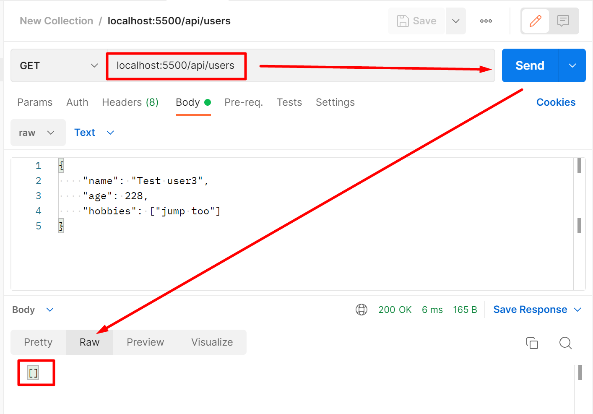
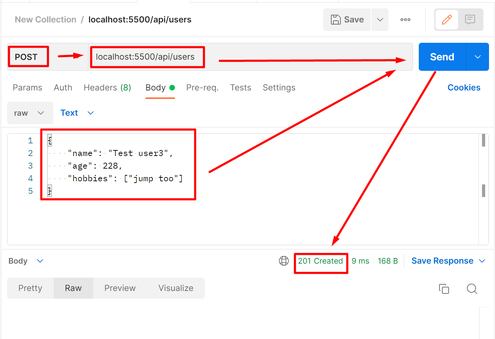
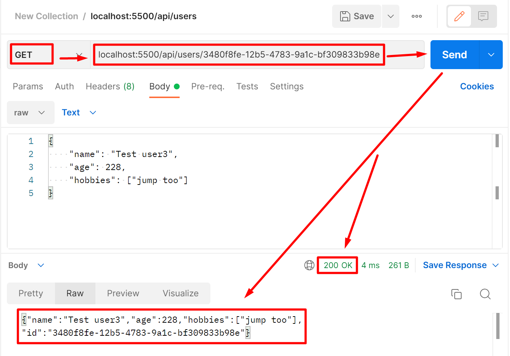
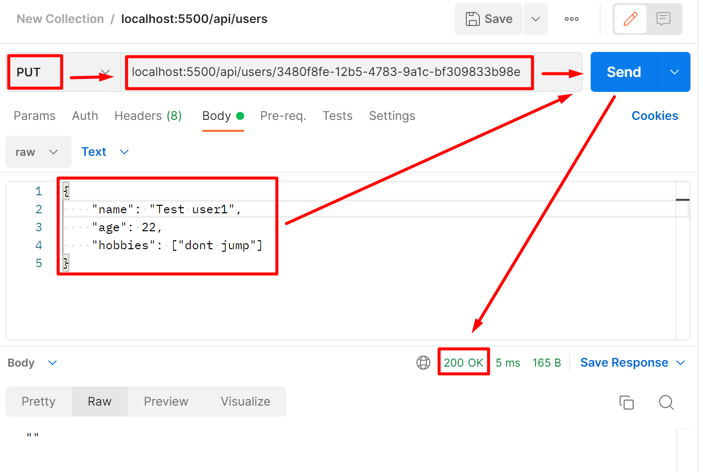
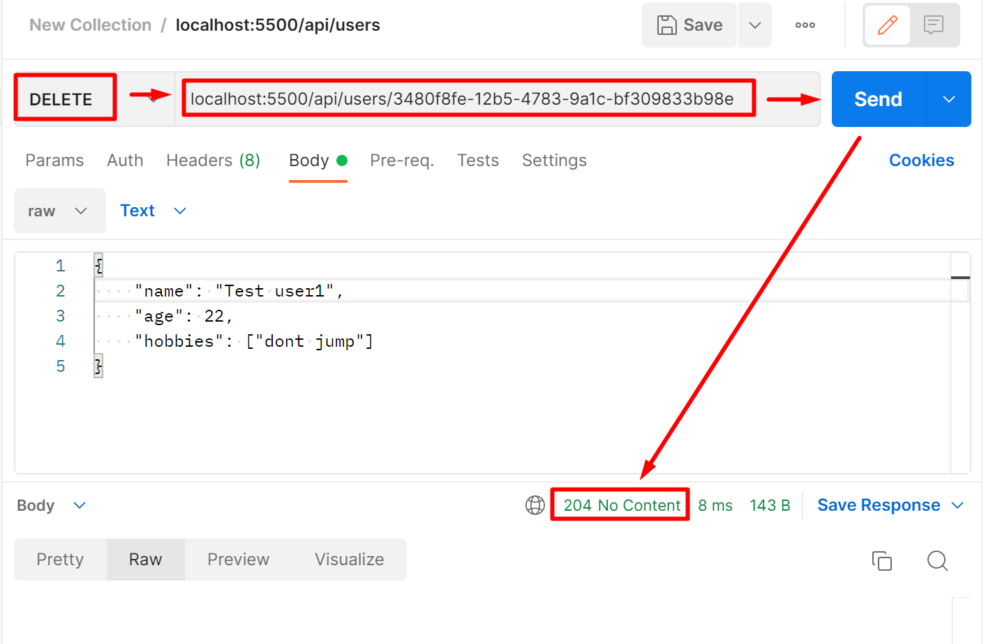

# CRUD-API
### Setup

```bash
npm install
```

### Development with nodemon and tsc --watch

```bash
npm run start:dev
```

### Run without nodemon and tsc --watch

```bash
npm run start:prod
```

### Starts multiple instances of your application using the Node.js Cluster API 

```bash
npm run start:multi
```

### Run tests with jest

```bash
npm run test
```

## Postman

Setup desktop version of Postman to test CRUP API

## Usage

### List all records



- Server should answer with status code 200 and all users records

### Post (Create) Record



- Server should answer with status code 201 and newly created record
- Server should answer with status code 400 and corresponding message if request body does not contain required fields

### Get by Id



- Server should answer with status code 200 and and record with id === userId if it exists
- Server should answer with status code 400 and corresponding message if userId is invalid (not uuid)
- Server should answer with status code 404 and corresponding message if record with id === userId doesn't exist

### Put (Update) Record



- Server should answer with status code 200 and updated record
- Server should answer with status code 400 and corresponding message if userId is invalid (not uuid)
- Server should answer with status code 404 and corresponding message if record with id === userId doesn't exist

> in Body should be object with attributes:
- id — unique identifier (string, uuid) generated on server side
- username — user's name (string, required)
- age — user's age (number, required)
- hobbies — user's hobbies (array of strings or empty array, required)
### Delete Record



- Server should answer with status code 204 if the record is found and deleted
- Server should answer with status code 400 and corresponding message if userId is invalid (not uuid)
- Server should answer with status code 404 and corresponding message if record with id === userId doesn't exist

> in Body should be object with attributes:
- id — unique identifier (string, uuid) generated on server side
- username — user's name (string, required)
- age — user's age (number, required)
- hobbies — user's hobbies (array of strings or empty array, required)